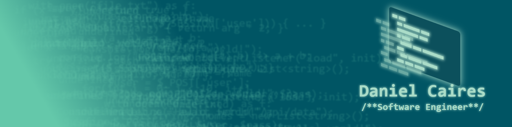

<!--## Hi there! I'm Daniel -->

##
I'm a developer with 15+ years of experience, working with Python, PHP, TypeScript, and Node.js to build internal systems, educational dashboards, and integrations. I bring a strategic view to projects, anticipating challenges and proposing efficient solutions while keeping execution aligned with goals. With a strong academic background, I’ve developed solid research and problem-solving skills, an analytical mindset in math and statistics, and the ability to communicate ideas clearly and effectively.
Feel free to check out my projects and connect!

  
  
  <!--img src="https://cdn.jsdelivr.net/gh/devicons/devicon@latest/icons/java/java-original-wordmark.svg" alt="Java" style="width:60px; height:60px;" />
          
  
  
  
  
          

## Find me

<!--

-->
